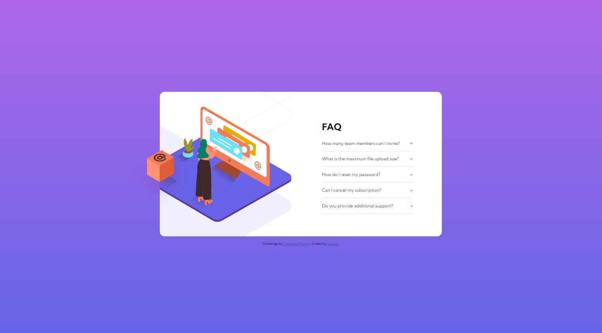

# Frontend Mentor - FAQ accordion card solution

This is a solution to the [FAQ accordion card challenge on Frontend Mentor](https://www.frontendmentor.io/challenges/faq-accordion-card-XlyjD0Oam). Frontend Mentor challenges help you improve your coding skills by building realistic projects. 

## Table of contents

- [Overview](#overview)
  - [The challenge](#the-challenge)
  - [Screenshot](#screenshot)
  - [Links](#links)
- [My process](#my-process)
  - [Built with](#built-with)
  - [Useful resources](#useful-resources)
- [Author](#author)

## Overview

### The challenge

Users should be able to:

- View the optimal layout for the component depending on their device's screen size
- See hover states for all interactive elements on the page
- Hide/Show the answer to a question when the question is clicked

### Screenshot

### Links

- Solution URL: [Click Here](https://your-solution-url.com)
- Live Site URL: [Live Site](https://faq-card-lexzee.vercel.app/)

## My process

### Built with

- Semantic HTML5 markup
- Flexbox
- Mobile-first workflow
- [React](https://reactjs.org/) - JS library

### Useful resources

- [Tutorials Point](https://www.tutorialspoint.com/how-to-create-accordion-in-reactjs#) - This helped me for with the accordion rendering

## Author

- Website - [Abdulquddus Abdulrahman (Lexzee)](https://github.com/lexzee)
- Frontend Mentor - [@lexzee](https://www.frontendmentor.io/profile/lexzee)
- Twitter - [@devlexzee](https://www.twitter.com/devlexzee)
